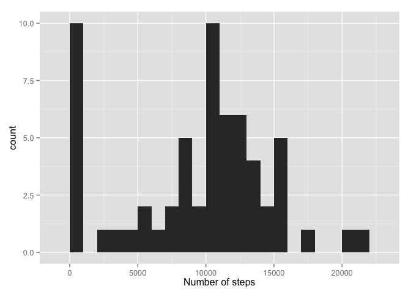

# Reproducible Research: Peer Assessment 1


## Loading and preprocessing the data

First I will load the data into R:


```r
rawData <- read.csv('activity.csv')
```

## What is mean total number of steps taken per day?

I will now make a collapsed dataset that reports the mean and median by day:


```
##       Group.1       x medianByDay[, 2]
## 1  2012-10-01     NaN               NA
## 2  2012-10-02  0.4375                0
## 3  2012-10-03 39.4167                0
## 4  2012-10-04 42.0694                0
## 5  2012-10-05 46.1597                0
## 6  2012-10-06 53.5417                0
## 7  2012-10-07 38.2465                0
## 8  2012-10-08     NaN               NA
## 9  2012-10-09 44.4826                0
## 10 2012-10-10 34.3750                0
## 11 2012-10-11 35.7778                0
## 12 2012-10-12 60.3542                0
## 13 2012-10-13 43.1458                0
## 14 2012-10-14 52.4236                0
## 15 2012-10-15 35.2049                0
## 16 2012-10-16 52.3750                0
## 17 2012-10-17 46.7083                0
## 18 2012-10-18 34.9167                0
## 19 2012-10-19 41.0729                0
## 20 2012-10-20 36.0938                0
## 21 2012-10-21 30.6285                0
## 22 2012-10-22 46.7361                0
## 23 2012-10-23 30.9653                0
## 24 2012-10-24 29.0104                0
## 25 2012-10-25  8.6528                0
## 26 2012-10-26 23.5347                0
## 27 2012-10-27 35.1354                0
## 28 2012-10-28 39.7847                0
## 29 2012-10-29 17.4236                0
## 30 2012-10-30 34.0938                0
## 31 2012-10-31 53.5208                0
## 32 2012-11-01     NaN               NA
## 33 2012-11-02 36.8056                0
## 34 2012-11-03 36.7049                0
## 35 2012-11-04     NaN               NA
## 36 2012-11-05 36.2465                0
## 37 2012-11-06 28.9375                0
## 38 2012-11-07 44.7326                0
## 39 2012-11-08 11.1771                0
## 40 2012-11-09     NaN               NA
## 41 2012-11-10     NaN               NA
## 42 2012-11-11 43.7778                0
## 43 2012-11-12 37.3785                0
## 44 2012-11-13 25.4722                0
## 45 2012-11-14     NaN               NA
## 46 2012-11-15  0.1424                0
## 47 2012-11-16 18.8924                0
## 48 2012-11-17 49.7882                0
## 49 2012-11-18 52.4653                0
## 50 2012-11-19 30.6979                0
## 51 2012-11-20 15.5278                0
## 52 2012-11-21 44.3993                0
## 53 2012-11-22 70.9271                0
## 54 2012-11-23 73.5903                0
## 55 2012-11-24 50.2708                0
## 56 2012-11-25 41.0903                0
## 57 2012-11-26 38.7569                0
## 58 2012-11-27 47.3819                0
## 59 2012-11-28 35.3576                0
## 60 2012-11-29 24.4688                0
## 61 2012-11-30     NaN               NA
```

I will now generate a histogram showing the total number of steps taken per day


```r
byDay <- aggregate(rawData$steps, by=list(rawData$date), FUN = sum, na.rm = T)
library(ggplot2)
qplot(byDay$x, geom='histogram', data=byDay,  binwidth = 1000, xlab='Number of steps')
```

 

## What is the average daily activity pattern?

Below is a time-series plot by 5 minute interval throughout the day, averaged over each day:


```r
z <- aggregate(rawData$steps, by = list(rawData$interval), FUN = mean, na.rm=T)

max(z$x)
```

```
## [1] 206.2
```

```r
g <- ggplot(z, aes(Group.1, x)) + geom_line() + xlab('5-minute time intervals')
g
```

 

## Imputing missing values

The total number of missing values in the dataset is:


```r
sum(is.na(rawData))
```

```
## [1] 2304
```

Now I will replace all NA's with the mean for that day.  I will use this new dataset to calculate a new mean for each day as well as the corresponding histogram of the sum. 


```r
temp<-merge(rawData, meanByDay, by.x='date', by.y='Group.1')

for(i in 1:length(temp[,1])){
  
  if(is.na(temp[i,2])){
    temp[i,2] <- temp[i,4]
  }
}

aggregate(temp$steps, by = list(temp$date), FUN = mean)
```

```
##       Group.1       x
## 1  2012-10-01     NaN
## 2  2012-10-02  0.4375
## 3  2012-10-03 39.4167
## 4  2012-10-04 42.0694
## 5  2012-10-05 46.1597
## 6  2012-10-06 53.5417
## 7  2012-10-07 38.2465
## 8  2012-10-08     NaN
## 9  2012-10-09 44.4826
## 10 2012-10-10 34.3750
## 11 2012-10-11 35.7778
## 12 2012-10-12 60.3542
## 13 2012-10-13 43.1458
## 14 2012-10-14 52.4236
## 15 2012-10-15 35.2049
## 16 2012-10-16 52.3750
## 17 2012-10-17 46.7083
## 18 2012-10-18 34.9167
## 19 2012-10-19 41.0729
## 20 2012-10-20 36.0938
## 21 2012-10-21 30.6285
## 22 2012-10-22 46.7361
## 23 2012-10-23 30.9653
## 24 2012-10-24 29.0104
## 25 2012-10-25  8.6528
## 26 2012-10-26 23.5347
## 27 2012-10-27 35.1354
## 28 2012-10-28 39.7847
## 29 2012-10-29 17.4236
## 30 2012-10-30 34.0938
## 31 2012-10-31 53.5208
## 32 2012-11-01     NaN
## 33 2012-11-02 36.8056
## 34 2012-11-03 36.7049
## 35 2012-11-04     NaN
## 36 2012-11-05 36.2465
## 37 2012-11-06 28.9375
## 38 2012-11-07 44.7326
## 39 2012-11-08 11.1771
## 40 2012-11-09     NaN
## 41 2012-11-10     NaN
## 42 2012-11-11 43.7778
## 43 2012-11-12 37.3785
## 44 2012-11-13 25.4722
## 45 2012-11-14     NaN
## 46 2012-11-15  0.1424
## 47 2012-11-16 18.8924
## 48 2012-11-17 49.7882
## 49 2012-11-18 52.4653
## 50 2012-11-19 30.6979
## 51 2012-11-20 15.5278
## 52 2012-11-21 44.3993
## 53 2012-11-22 70.9271
## 54 2012-11-23 73.5903
## 55 2012-11-24 50.2708
## 56 2012-11-25 41.0903
## 57 2012-11-26 38.7569
## 58 2012-11-27 47.3819
## 59 2012-11-28 35.3576
## 60 2012-11-29 24.4688
## 61 2012-11-30     NaN
```

```r
m <- aggregate(temp$steps, by = list(temp$date), FUN = sum)

ggplot(m, aes(x)) + geom_histogram(binwidth=1000)
```

 


## Are there differences in activity patterns between weekdays and weekends?


Finally I will split the data by weekend or weekday and mike a final plot:


```r
rawData$weekday <- weekdays(as.Date(rawData$date))
rawData$recoded <- ifelse(rawData$weekday == "Saturday" | rawData$weekday == "Sunday",'Weekend','Weekday')

g <- aggregate(rawData$steps, by = list(rawData$interval, rawData$recoded), FUN = mean, na.rm=T)

ggplot(g, aes(Group.1, x)) + geom_line() + facet_grid(Group.2 ~ .) + xlab('5-minute intervals')
```

 


